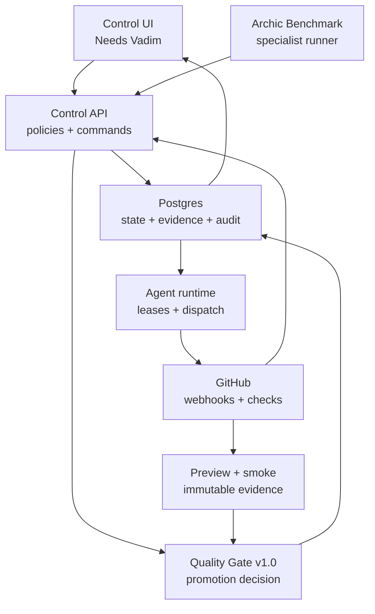

# Archic Control architecture

## Operating model

Archic Control is a control plane, not a monolithic worker. Specialist runners execute bounded tasks and return evidence. Control decides the next safe transition.

## Bounded contexts

| Context | Owns | Does not own |
|---|---|---|
| Portfolio | projects, phase, repository, production URL | source code |
| Quality | standard versions, runs, checks, findings, evidence | browser implementation details |
| Workflow | stages, attempts, retries, external run links | agent model internals |
| Decisions | human boundary, recommendation, resolution, audit | routine QA work |
| Integrations | signed events, idempotency, provider mapping | provider-specific UI |
| Automation | task leases, dispatch tokens, retries, worker evidence | model internals |
| Deployment | preview identity, SHA/ref, smoke checks, promotion evidence | rebuilds after approval |

## State model

The intended project path is:

`lead → research → brief → development → quality → preview → approval → production → monitoring`

Promotion is policy-driven:

- **quality → preview:** automated blockers cleared and no critical journey failure;
- **preview → approval:** score threshold met, manual evidence complete, Polish ready;
- **approval → production:** one final human approval, protected main checks, deployment and smoke tests pass.

A failed stage creates or updates a finding. It does not create a Vadim decision unless retries are exhausted and a genuine risk/scope choice remains.

## Data model

- `projects`: canonical project identity and phase;
- `quality_runs`: immutable-ish run input/output by standard version;
- `findings`: deduplicated actionable defects with evidence and agent ownership;
- `workflow_runs`: execution ledger across runners;
- `decisions`: the only source for “Needs Vadim”;
- `integration_events`: idempotent provider event inbox;
- `journey_manifests`: versioned project-specific critical paths;
- `agent_tasks`: priority queue, leases, dispatch, retries and results;
- `deployment_previews` and `smoke_checks`: immutable artifact evidence;
- `audit_log`: human and privileged actions.

## Integration contracts

- `POST /api/integrations/benchmark`: bearer-authenticated report ingestion;
- `POST /api/quality/evaluate`: deterministic gate evaluation;
- `POST /api/webhooks/github`: SHA-256 signed GitHub event inbox;
- `GET /api/cron/sync-benchmark`: scheduled pull from the current benchmark artifact;
- `GET|POST /api/cron/reconcile`: retry-budget and escalation reconciliation.
- `GET|POST /api/cron/dispatch`: GitHub App task dispatch;
- `POST /api/agents/tasks/*`: signed worker lease/start/complete protocol;
- `GET /api/projects/:id/journeys`: validated Playwright contract.

## Security boundary

The milestone uses a single-owner signed, HTTP-only session because “Needs Vadim” is presently a one-person approval boundary. The data model already records actors and supports a later multi-user identity provider. Production refuses to start operationally without explicit secrets and durable Postgres.

External calls use least-purpose secrets. GitHub delivery IDs and benchmark run identity make repeated delivery safe.

## Next bounded milestone

1. Install the worker adapter and GitHub App on each managed repository.
2. Add project-specific `archic:autofix` implementations with protected-path and diff limits.
3. Promote an already-tested preview after final approval and record rollback identity.
4. Add lead discovery and scoring as a separate pipeline feeding the same project/decision model.
